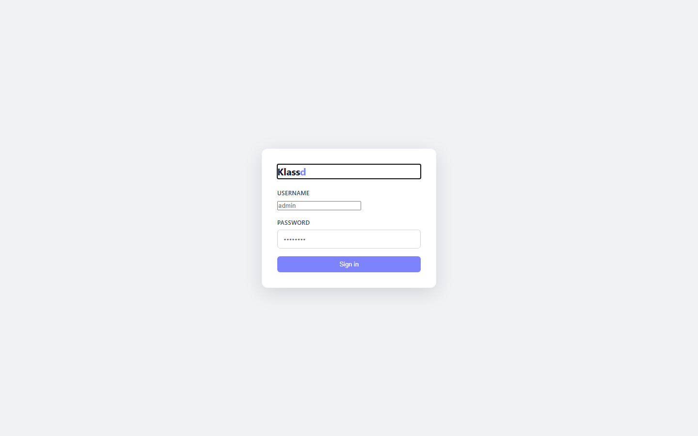
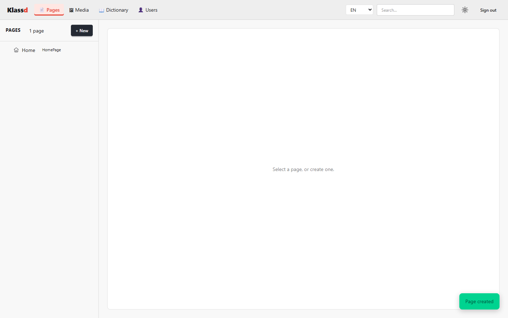
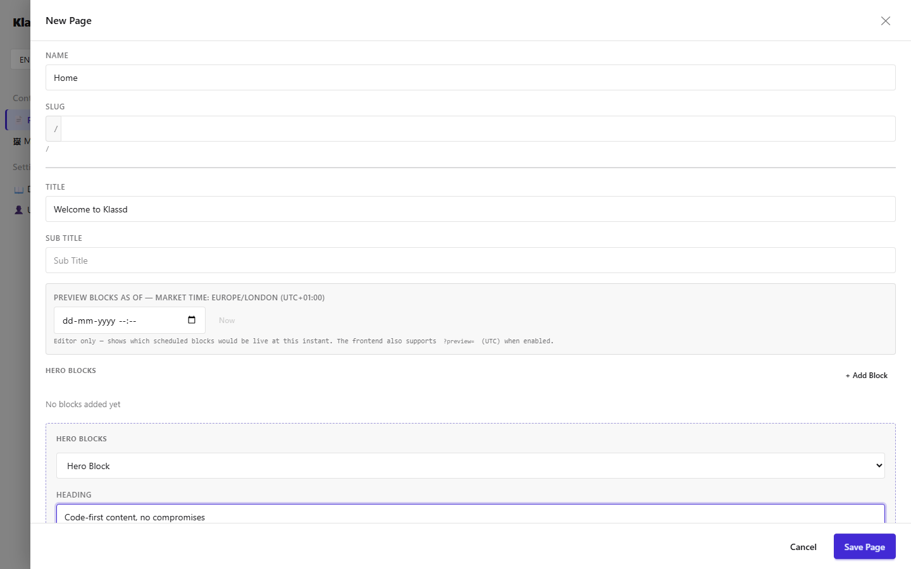
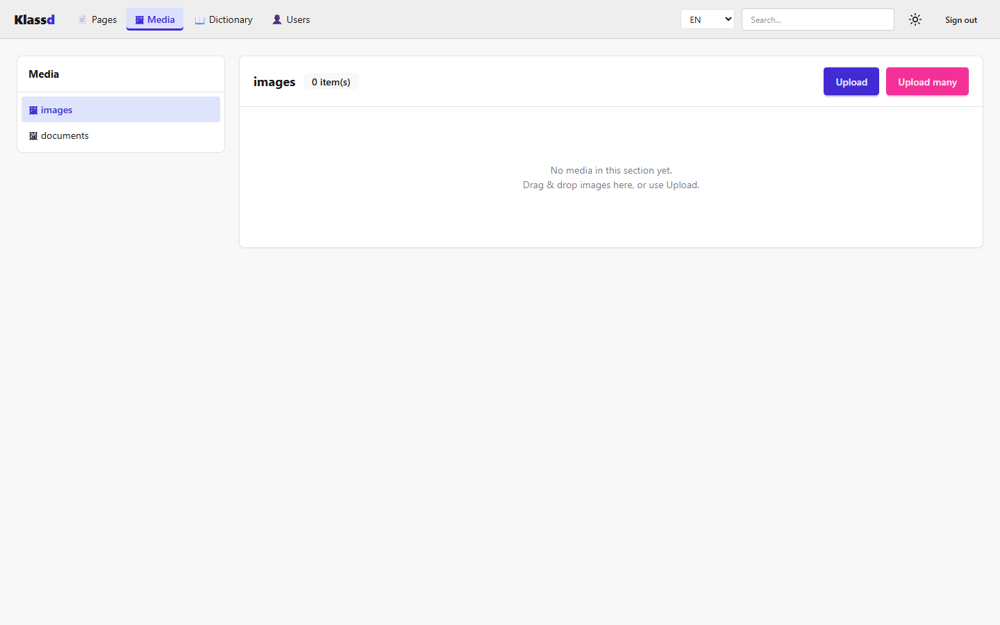
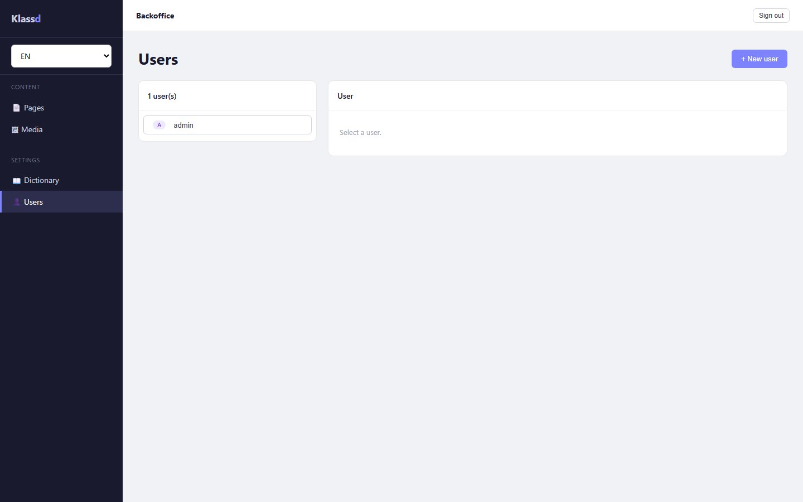
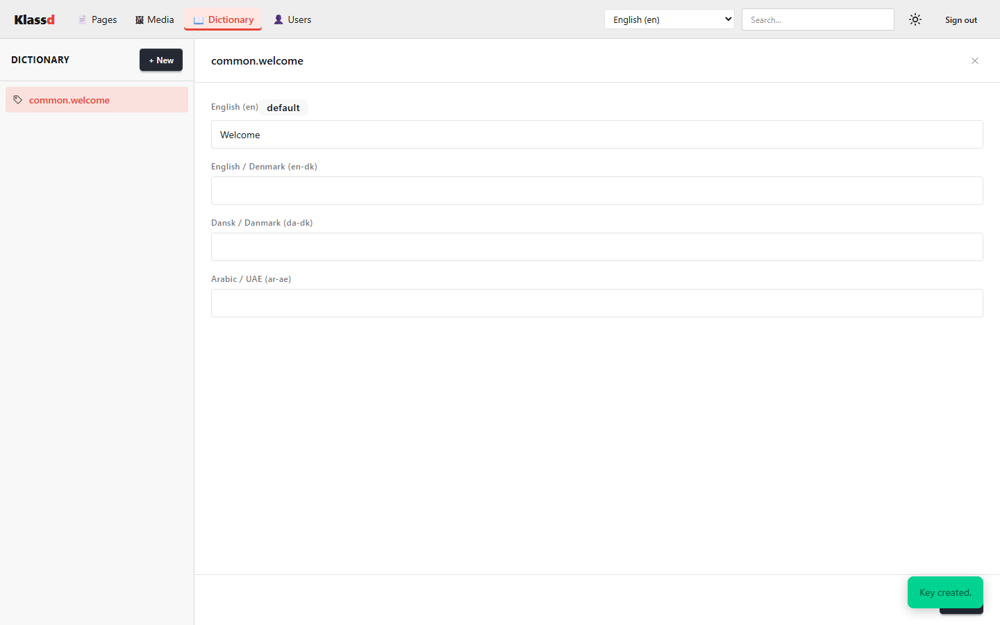
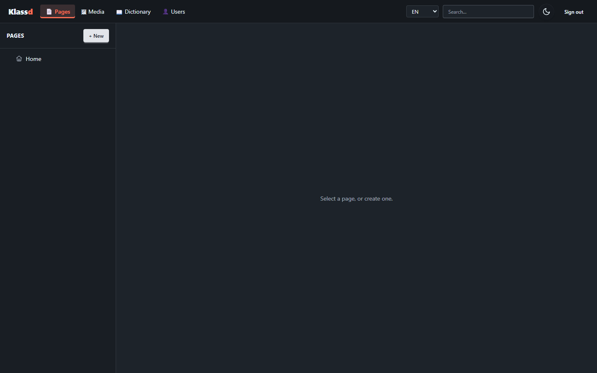
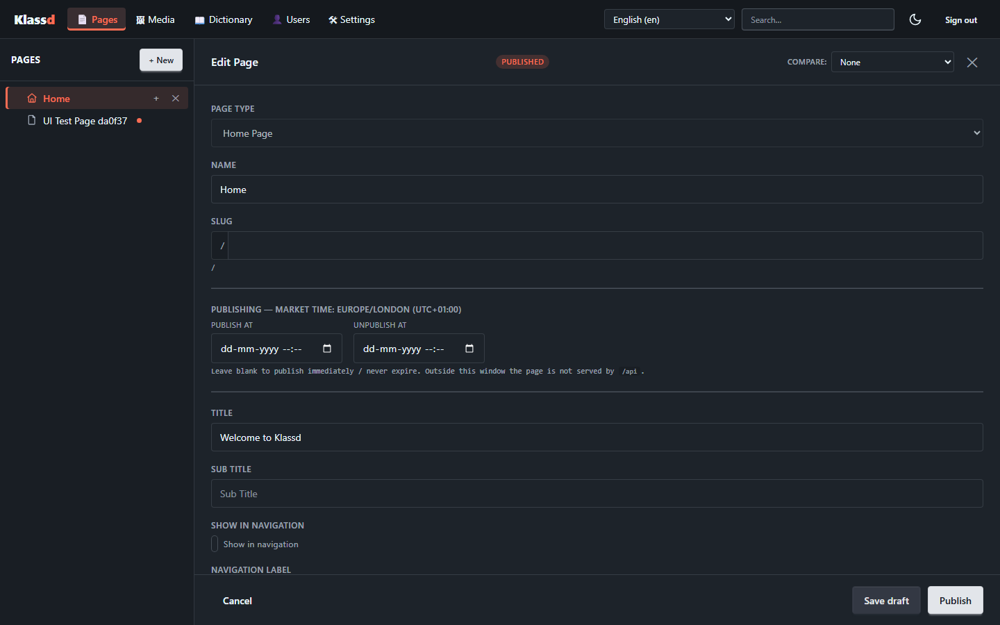
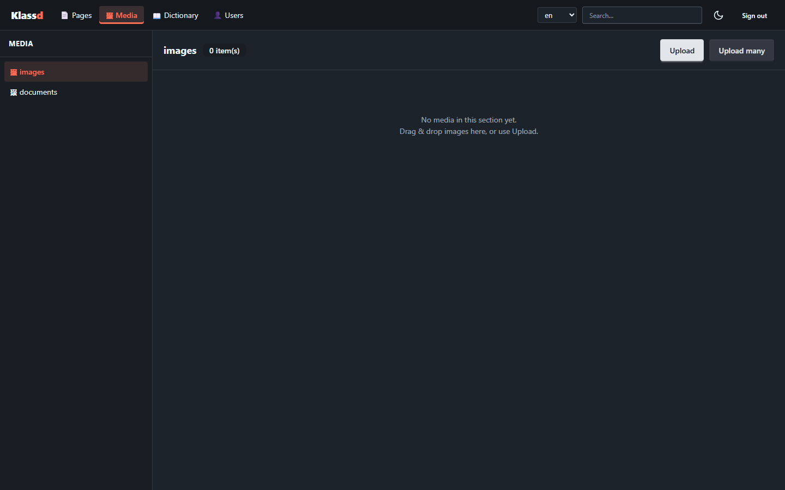

# Klassd

[](LICENSE)
[](https://dotnet.microsoft.com/)
[](https://github.com/getklassd/Klassd/actions/workflows/ci.yml)
[](#-beta)

> ## ⚠️ Beta
>
> Klassd is in **public beta** (`0.0.x`). It builds, is covered by unit/integration/UI tests, and
> runs — but it's young: the **API surface may change between releases** until `1.0`, and you may hit
> rough edges. Pin your package versions, read the release notes when upgrading, and please
> [open an issue](https://github.com/getklassd/Klassd/issues) for anything that looks off.
> Not yet recommended for production without your own evaluation.

A **code-first, NuGet-distributed headless CMS** for .NET. You define your content model —
pages, blocks and property types — as plain **C# classes**. The engine reflects over them to
drive a **Blazor (Interactive Server) admin** at `/admin` and a **headless JSON API** at `/api`.
No content-type designer, no database migrations to hand-write, no JavaScript build step.

> Your content schema lives in your codebase, versioned with your app and refactored with your IDE.

## Why Klassd

- **Code-first** — content types are C# classes; rename a property in your IDE, not a CMS UI.
- **Headless** — public JSON delivery API; render with any frontend (or none).
- **Pluggable storage** — MongoDB, PostgreSQL or SQLite via a single `.UseXxx(...)` call.
- **Pluggable media** — file system, Amazon S3 or Google Cloud Storage, with named sections.
- **Localization built in** — per-locale fields via `[Localized]`, market-local scheduling.
- **Drafts, versioning & roles** — edit a draft without touching what's live, publish when ready, roll back to any prior version; capability-based roles (Administrator/Editor/Author).
- **Extensible** — opt-in full-text search, webhooks, GraphQL, in-process notifications you can hook or cancel.
- **No JS toolchain** — the admin is Blazor; cloud SDKs stay isolated in their own packages.

## The admin

The Blazor admin at `/admin` is generated from your C# content types — no JavaScript build step,
no separate schema to maintain. Pages, blocks, fields, media and localization all come from your code.

| Sign in | Page tree |
|:---:|:---:|
| [](docs/images/01-login.png) | [](docs/images/02-pages.png) |
| **Page editor (fields + blocks)** | **Media library** |
| [](docs/images/03-page-editor.png) | [](docs/images/04-media.png) |
| **Users** | **Dictionary** |
| [](docs/images/05-users.png) | [](docs/images/06-dictionary.png) |

…and the same shell in **dark mode** (toggled per user, persisted to preferences):

| Page tree | Page editor | Media |
|:---:|:---:|:---:|
| [](docs/images/02-pages-dark.png) | [](docs/images/03-page-editor-dark.png) | [](docs/images/04-media-dark.png) |

The page editor above is fully driven by the `HomePage`/`HeroBlock` C# classes — the `Title` field,
the `Hero Blocks` area, and per-block scheduling are all reflected from your model.

## Quickstart

Install the engine plus one storage adapter. While Klassd is in beta the packages are
**prerelease**, so pass `--prerelease` (or pin an explicit version):

```bash
dotnet add package Klassd.Backoffice --prerelease
dotnet add package Klassd.Data.Sqlite --prerelease
```

**1. Define content types as C# classes** (discovered automatically from your app's assembly):

```csharp
using Klassd.Core.Abstractions;

[CmsPage(DefaultSlug = "", Icon = "house")]   // Icon shows in the admin tree (built-in name or any emoji)
[AllowedChildren(typeof(ContentPage))]
public class HomePage : PageBase
{
    [Localized]                       // separate value per locale
    public string Title { get; set; } = "";
    public string SubTitle { get; set; } = "";
    public BlockArea HeroBlocks { get; set; } = new();
}

public class HeroBlock : BlockBase
{
    public string Heading { get; set; } = "";

    public MediaReference Image { get; set; } = new();   // media picker; stores the media item id
}
```

> Property editors are chosen by CLR type or an explicit `[CmsField(FieldType = "…")]`. `MediaReference`
> and `PageReference` are strongly-typed shortcuts for the media picker and page picker — equivalent to
> `[CmsField(FieldType = "media")]` / `"relationship"` on a `string`. Either style works.

**2. Wire it up** in `Program.cs`:

```csharp
var builder = WebApplication.CreateBuilder(args);

builder.Services
    .AddKlassd(builder.Configuration)                              // discovers your content types
    .UseSqlite(builder.Configuration.GetSection("Sqlite"))         // or .UseMongoDb / .UsePostgres
    .UseInMemoryCache();                                           // optional read-through cache

var app = builder.Build();
app.UseKlassd();   // auth + antiforgery + seed/init + static assets + /api + Blazor admin
app.Run();
```

```jsonc
// appsettings.json
"Sqlite": { "ConnectionString": "Data Source=klassd.db" }
```

> **Host `.csproj` — one required setting.** The Blazor admin ships entirely inside the
> `Klassd.Backoffice` package, so a host that has no `.razor` files of its own must opt in to the
> Blazor framework assets, or `/admin` 404s on `_framework/blazor.web.js` and never goes interactive:
>
> ```xml
> <PropertyGroup>
>   <RequiresAspNetWebAssets>true</RequiresAspNetWebAssets>
> </PropertyGroup>
> ```
>
> This can't be set by the package itself: the property gates a **restore-time** framework download,
> and NuGet restore does not read a referenced package's MSBuild props (it would be circular), so a
> value Klassd set would arrive too late. It must live in your host project. *(If your host already
> has its own `.razor` files, the SDK turns this on automatically and you can omit it.)*

**3. Run** and open `/admin`. The public site reads published content from `/api/pages`.

See [`src/Klassd.Sample`](src/Klassd.Sample) for a complete runnable host with multiple page/block
types, a custom property editor, media sections and SSO examples.

## Media

Media is organized into named **sections**, each backed by its own **blob adapter**. Add a section
with `.AddMedia(...)` after choosing storage, and reference it from a field with
`[CmsField(FieldType = "media")]` (the admin renders an upload + picker; the field stores the item id):

```bash
dotnet add package Klassd.Media.FileSystem   # and/or .Media.S3, .Media.GoogleCloud
```

```csharp
builder.Services
    .AddKlassd(builder.Configuration)
    .UseSqlite(builder.Configuration.GetSection("Sqlite"))
    .AddMedia(media =>
    {
        // Local disk — longest image edge downscaled to 2000px in-browser before upload
        media.AddSection("images", s => s
            .UseFileSystem(Path.Combine(builder.Environment.ContentRootPath, "media", "images"))
            .AllowContentTypes("image/*")
            .ResizeImages(2000)
            .Breakpoints("default", "mobile", "tablet", "desktop"));  // focal-point breakpoints

        // Amazon S3 (or any S3-compatible backend via ServiceUrl/ForcePathStyle)
        media.AddSection("documents", s => s
            .UseS3(o =>
            {
                o.Bucket = "my-cms-docs";
                o.Region = "eu-west-1";   // omit AccessKey/SecretKey to use the default AWS credential chain
            })
            .AllowContentTypes("application/pdf"));

        // Google Cloud Storage
        media.AddSection("video", s => s
            .UseGoogleCloudStorage(o =>
            {
                o.Bucket = "my-cms-video";
                o.CredentialsPath = "/secrets/gcs.json";   // or CredentialsJson, or ambient ADC
            }));
    });
```

Each section is independent: mix local disk, S3 and GCS in the same app, set per-section allowed
content types, downscale images on the client with `ResizeImages(maxEdgePixels)`, and declare the
focal-point `Breakpoints(...)` editors pick from (a single `"default"` when unset).

> **Need a backend we don't ship** (Azure Blob, an in-house store, …)? A media adapter is just an
> `IBlobStore` (three methods) plus a `UseXxx` extension. See
> [`examples/InMemoryMediaAdapter`](examples/InMemoryMediaAdapter) for a complete, annotated walkthrough.

## Relationships

Link one page to another with a **relationship** field. Declare a `PageReference` property (or use
`[CmsField(FieldType = "relationship")]` on a `string`); the admin renders a page picker. Restrict
which page types may be linked with `[AllowedRelations(...)]` — omit it to allow any page type:

```csharp
public class ArticlePage : PageBase
{
    public string Title { get; set; } = "";

    [AllowedRelations(typeof(AuthorPage))]      // picker only lists AuthorPage; omit for any type
    public PageReference Author { get; set; } = new();
}
```

The field stores the target's **`ContentId`** — the stable, locale-agnostic content identity, *not* a
single translation's id — so a link survives across locales. Resolve it from the frontend with
`GET /api/pages/content/{contentId}`, which returns the page (and its translations); pick the one
matching the locale you're rendering. Relationship fields are best left un-`[Localized]` so every
translation shares the same link.

## Custom adapters

Klassd's storage and media backends are swappable extension points — the engine depends only on
interfaces in `Klassd.Abstractions`, never on a concrete database or cloud SDK. To target a backend
we don't ship, implement the relevant interface and add a `UseXxx` registration extension. Worked,
compilable examples live in [`examples/`](examples):

| Example | Implements | Extension point |
|---------|-----------|-----------------|
| [`InMemoryMediaAdapter`](examples/InMemoryMediaAdapter) | `IBlobStore` | `UseInMemoryBlobs()` on a media section |
| [`InMemoryStorageAdapter`](examples/InMemoryStorageAdapter) | `IPageStore`, `IMediaStore`, `IDictionaryStore`, `IUserStore`, `IPreferencesStore`, `IUnitOfWork`, `IStorageInitializer` | `UseInMemoryStorage()` on the CMS builder |

## Content delivery & CORS

The headless **GET delivery** endpoints are **anonymous** so a public frontend can read published
content without credentials:

- `GET /api/pages`, `/api/pages/{id}`, `/api/pages/by-slug/{**slug}`, `/api/pages/content/{contentId}`, `/api/pages/{id}/translations`
- `GET /api/dictionary/resolved/{locale}`
- `GET /api/media/{id}`

Delivery serves **only live** content — a page must be **published** and within its publish window
(see *Drafts & publishing* below). Single-page GETs accept **`?depth=1`** to resolve `PageReference`
/`MediaReference` fields to URLs (a `references` map) and **`?expand=field,field`** to limit which
references resolve; `depth=0` (default) returns the raw shape.

Everything else — page/media/dictionary **management**, users, preferences, and the `/admin` UI — still
requires the admin cookie.

Restrict which browser origins may fetch via JS with config (empty/unset ⇒ any origin):

```jsonc
"Klassd": {
  "Cors": { "AllowedOrigins": [ "https://www.example.com", "https://shop.example.com" ] }
}
```

> CORS only limits cross-origin **browser** requests; it is not an authorization boundary for
> server-side callers. Delivery content is genuinely public — don't put gated content in it.

### Optional: gate delivery with an API key

This is a headless CMS, so the rendering model is the consumer's choice. If your frontend renders
**server-side** (SSR/SSG/BFF), you can require an API key on the delivery GETs — the key stays on
your server, never in the browser:

```jsonc
"Klassd": {
  "Delivery": { "RequireApiKey": true, "ApiKey": "<long-random-secret>", "ApiKeyHeader": "X-Api-Key" }
}
```

Callers then send `X-Api-Key: <secret>`; requests without it get `401`. Default is **off** (public).

> Do **not** enable this for a browser/SPA that calls the CMS directly — the key would ship in the
> client bundle and provide no real protection. For a client-side app that needs gating, put a
> backend-for-frontend (BFF) in front that holds the key, or use per-user auth.

## Drafts, versioning & publishing

Editing is **draft-first**: a save writes a working **draft** and leaves the published page (and the
delivery API) untouched until you **Publish**. New pages aren't delivered until first published.

- **Publish / Unpublish / Discard draft** from the editor; a state badge shows *Draft* / *Published* /
  *Published • unsaved draft*, and the page tree marks pages with pending drafts.
- **Version history + rollback** — every publish records an immutable version; *Restore* loads a prior
  version back into the draft to review, then publish. Retention is configurable
  (`Klassd:Versioning:HistoryLimit`, default 20; `0` = keep all).
- **Scheduled publishing** — an optional per-page publish window (`PublishAt`/`UnpublishAt`), authored in
  market-local time. (Per-**block** scheduling also exists — see *Deployment notes*.)
- **Management API:** `PUT /api/pages/{id}` saves the draft; `POST …/publish`, `POST …/unpublish`,
  `DELETE …/draft`, `GET …/versions`, `POST …/versions/{versionId}/restore`.

## Roles & permissions

Capability-based authorization. Built-in roles grant a union of capabilities; a user may hold several:

- **Administrator** (everything), **Editor** (edit **and publish** content/media/dictionary/globals),
  **Author** (edit + save drafts, **cannot publish**).
- Assigned in the **Users** area. Enforced server-side (role claims + a `RequireCapability` gate on the
  management endpoints) and reflected in the UI (e.g. Authors don't see *Publish*). A user with no roles
  is treated as Administrator (back-compat).

## Full-text search

```bash
dotnet add package Klassd.Search.Lucene --prerelease
```
```csharp
builder.Services.AddKlassd(cfg).UseSqlite(...).UseLuceneSearch(o => o.IndexPath = "…");
```

Opt-in, **storage-agnostic** tokenized + ranked search over Lucene.NET (no per-database FTS). The index
is kept live via content events and **rebuilt from the database on startup** when empty (so a fresh/
ephemeral instance self-heals). The admin search uses it for pages when registered. Without it, admin
search falls back to a built-in substring scan.

## Webhooks, events & notifications

Two complementary extension points fire on content changes:

- **Webhooks** (`Klassd.Webhooks`, opt-in) — POST `page.created/updated/published/unpublished/deleted`
  to subscribed URLs, HMAC-SHA256 signed. For integrations (rebuild a static site, bust a CDN, …).
  ```csharp
  builder.Services.AddKlassd(cfg).UseSqlite(...)
      .UseWebhooks(o => o.Subscriptions.Add(new() { Url = "https://example.com/hook", Secret = "…" }));
  ```
- **In-process notifications** — synchronous, ordered, **cancelable** hooks (Umbraco-style): paired
  `PageSaving`/`PageSaved`, `PagePublishing`/`PagePublished`, `PageUnpublishing`/`PageUnpublished`,
  `PageDeleting`/`PageDeleted`. A `…ing` handler can **mutate** the entity in-flight or **cancel** the
  operation. Register with `AddNotificationHandler<TNotification, THandler>()`.
- For pure side-effects across processes, you can also register an `ICmsEventListener` directly (the
  async, failure-isolated fan-out the webhook + search packages use).

## GraphQL (opt-in)

```bash
dotnet add package Klassd.GraphQL --prerelease
```
```csharp
builder.Services.AddKlassd(cfg).UseSqlite(...).UseGraphQL();   // then app.MapKlassdGraphQL();
```

A read-only GraphQL delivery API at `/graphql` (HotChocolate), mirroring the REST delivery
(`pages`, `page`, `pageBySlug`, `pageTranslations`, `global`, `locales`) — live content only. **Not
referenced by core**; the host opts in.

## Packages

| Package | Purpose |
|---------|---------|
| `Klassd.Abstractions` | Storage adapter interfaces + DB-agnostic POCOs (no deps) |
| `Klassd.Core` | Content base types, attributes, registries, localization, default property types |
| `Klassd.Backoffice` | The engine: `AddKlassd`/`UseKlassd`, Blazor admin, headless `/api` |
| `Klassd.Data.MongoDb` / `.Data.Postgres` / `.Data.Sqlite` | Storage adapters |
| `Klassd.Cache.InMemory` / `.Cache.Redis` / `.Cache.Hybrid` | Read-through page cache adapters (in-process, distributed, or L1+L2 over Microsoft.Extensions.Caching.Hybrid) |
| `Klassd.Media.FileSystem` / `.Media.S3` / `.Media.GoogleCloud` | Media blob adapters |
| `Klassd.Auth.OpenIdConnect` | OIDC/OAuth SSO for the backoffice (SAML via the generic seam) |
| `Klassd.Search.Lucene` | Full-text search index over Lucene.NET (opt-in; storage-agnostic) |
| `Klassd.Webhooks` | HMAC-signed webhook delivery of content-change events (opt-in) |
| `Klassd.GraphQL` | GraphQL delivery API over HotChocolate (opt-in; not in core) |

The engine package carries **no** MongoDB/AWS/Google dependency — each adapter keeps its SDK
isolated, so you only pull in what you wire up.

## Deployment notes

### Time zones (content scheduling)

Block scheduling is **market-local**: each locale carries an IANA `TimeZone` (e.g. `Europe/Berlin`,
`Asia/Dubai`) and editors author schedule times as wall-clock time in that market. Times are stored
and compared in UTC, so delivery is correct across markets simultaneously.

Resolving IANA time zones requires the **OS time-zone database**:

- **Debian/Ubuntu** base images (incl. the default `mcr.microsoft.com/dotnet/aspnet`) include it — nothing to do.
- **Alpine** images do not. Add it:

  ```dockerfile
  RUN apk add --no-cache tzdata
  ```

- **Chiseled / distroless**: use the `-extra` image variant (ships ICU + tz data), not the bare one.

If a configured locale time zone can't be resolved at startup, the engine logs a **warning**
(category `Klassd.Scheduling`) naming the locale and zone, and falls back to UTC for that
market (so scheduling would be offset-wrong). Watch for that warning when deploying to slim images.

> Note: this is about the time-zone database, not `InvariantGlobalization` — leaving globalization
> invariant does not remove the tz-data requirement.

## Building & testing

```bash
dotnet build Klassd.slnx -c Release
```

Tests use [TUnit](https://tunit.dev/) on the Microsoft.Testing.Platform. On the .NET 10 SDK,
`dotnet test` does not work for these — run each project directly:

```bash
dotnet run --project tests/Klassd.UnitTests -c Release
dotnet run --project tests/Klassd.IntegrationTests -c Release   # needs Docker (Testcontainers); container tests auto-skip without it
dotnet run --project tests/Klassd.UiTests -c Release            # needs Playwright browsers (see below)
```

UI tests are Playwright E2E; first run installs the browser:

```bash
pwsh tests/Klassd.UiTests/bin/Release/net10.0/playwright.ps1 install chromium
```

## Security

See [SECURITY.md](SECURITY.md) for the vulnerability reporting process and important notes on the
public delivery endpoints.

## Built with AI

Klassd was built largely with AI assistance — [Claude Code](https://claude.com/claude-code) (Anthropic's
Claude) was used throughout for design, implementation, refactoring and tests, working alongside a human
maintainer who reviews and directs the work. The architecture, content model and adapter design were
shaped through that collaboration, and most commits are co-authored accordingly.

It's called out here for transparency: read the code with the same scrutiny you'd give any dependency,
and please report anything that looks off via [the issues](https://github.com/getklassd/Klassd/issues)
or [SECURITY.md](SECURITY.md).

## Acknowledgements

Klassd stands on excellent open-source work. Thank you to the maintainers of:

- **[daisyUI](https://daisyui.com)** ([MIT](https://github.com/saadeghi/daisyui/blob/master/LICENSE)) — the component layer the admin UI is built on. Vendored as `Klassd.Backoffice/wwwroot/daisyui.css` (the file keeps its license header), so no build step is required.
- **[Tailwind CSS](https://tailwindcss.com)** ([MIT](https://github.com/tailwindlabs/tailwindcss/blob/main/LICENSE)) — the utility/design-token foundation daisyUI is built on.
- **[Lucide](https://lucide.dev)** ([ISC](https://github.com/lucide-icons/lucide/blob/main/LICENSE)) — the page-type / UI icon set (`TypeIcon`).
- **[Vue](https://vuejs.org)** + **[Vite](https://vitejs.dev)** ([MIT](https://github.com/vuejs/core/blob/main/LICENSE)) — the SSR frontend and its build.
- **[Bun](https://bun.sh)** ([MIT](https://github.com/oven-sh/bun/blob/main/LICENSE)) — the frontend runtime/server.
- **[Playwright](https://playwright.dev)** ([Apache-2.0](https://github.com/microsoft/playwright/blob/main/LICENSE)) and **[TUnit](https://github.com/thomhurst/TUnit)** ([MIT](https://github.com/thomhurst/TUnit/blob/main/LICENSE)) — the test stack.
- **[.NET](https://dotnet.microsoft.com)** & Blazor ([MIT](https://github.com/dotnet/runtime/blob/main/LICENSE.TXT)) — the platform Klassd is written on.

## License

[MIT](LICENSE) © Mark Lonquist
